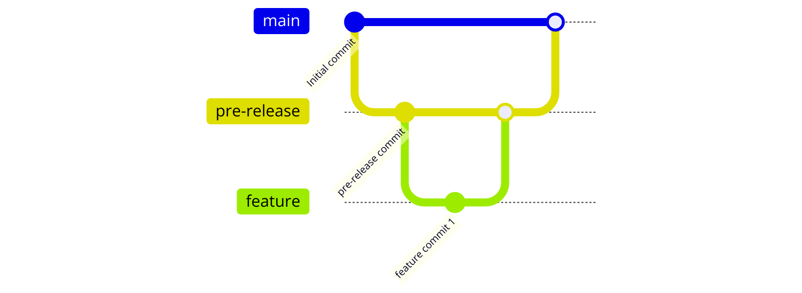
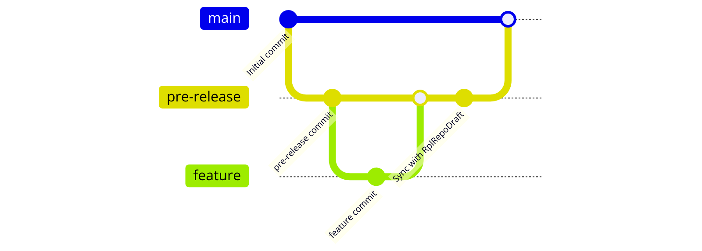

#Create list of topics
# Create list of sections in markdown language with link to each section
- [Development/Deployment process](#developmentdeployment-process)
- [AWS cloudformation templates](#aws-cloudformation-templates)
- [How to build/update CFN template](#how-to-buildupdate-cfn-template)
- [How to copy scripts to S3](#how-to-copy-scripts-to-s3)
- [How to do branching?](#how-to-do-branching)

## Development/Deployment process

Process for development and deployment has to be in this order: 

  1. Create a feature branch with name of Jira ticket
  2. Create Pull Request for merging into "main" branch.
  3. Merge the Pull Request into "main" branch.

### How to do branching?

**RPLRepoDraft**

  - The main branch is the default branch for the repository.
  - The feature branch is created from the main branch.
  - The feature branch is merged into the main branch.

       main ———> feature
                  |
                 feature ———> main

  

**Forked Repository**
  - The main branch is the default branch for the repository.
  - The feature branch is created from the pre-release branch.
  - The feature branch is merged into the pre-release branch.
  - The pre-release branch is merged into the main branch.
  
        pre-release ———> feature
                         feature ———> pre-release ———> main

  

**RplRepoDraft -> Forked Repository**
  - Create new feature branch in Forked Repository from pre-lease
  - Sync fork with main repository RplRepoDraft
  - Create Pull Request from feature branch to pre-release branch
  - Test the changes
  - Merge the Pull Request from pre-release branch to main branch

  

## How to fork new repository from RPLRepoDraft, configure it and deploy new features
1. Fork the RPLRepoDraft repository.
2. Clone the forked repository to your local machine so new repository is created with main branch.
3. Create new file config.json from /.rpl/files/config-template.json 
4. Update the config.json with your own values (do not change json structure).
5. Update the buildspec.yml variables with your own values. 
6. Create new branch pre-release from main branch.
6. Create a new feature branch named like JIRA ticket from branch pre-release branch.
7. Creat/Update a template or a script in feature branch
8. Pull Request from feature branch to pre-release branch
9. Test the changes
10. Merge the Pull Request from pre-release branch to main branch

 
# AWS cloudformation templates
## How to build/update CFN template:
1. Create/update new CFN template in format yaml/yml or json
2. Store this CFN template `TEMPLATES_FOLDER` or in its subfolder (max one level of subfolders is allowed)
3. Template name is file must be compliant with rules for Stack names.
4. Additonal code written in PYTHON or POWERSHELL or SQL has to be stored together with max one template in own subfolder
5. The subfolders should not contain any spaces or special characters 
6. The CFN template must have mandatory parameters
7. The CFN template must have the mandatory parameter named "Action" with a value of "S3Backup", "ScheduleDeploy" or "Deploy"
8. The CFN template must have the mandatory parameter named "Account" with a allowed values list of accounts like (integration-tools, eu2-travel, us2-front,...)
9. If CFN template use additional code so next mandatory parameters "Package" and "Path" and "BucketName" and "Version" are required without defined values.
10. If CFN template use nested templates so  mandatory parameters are "Account" and "Action" and "BucketName".
11. If CFN template use other parameters than mandatory so there must exist configuration file containing parameter=value and must be named with same name like CFN template and with extension `config` and stored together in same folder.

### Additional info
All templates must be stored in the "templates" folder or any of its subfolders. 
The name of this folder must be defined by the "TEMPLATES_FOLDER" key in the "./rpl/files/config.json" file. 
This folder should exist in the main Repository space. 
By default, the template folder is named "templates" and is already created for you.

## How to copy scripts to S3 
1. Create/Update script in scripts folder in main repository folder
2. All files are copied after PR to pre-relase to S3 Bucket/<REPO_NAME>/scripts>
3. All files are copied after PR to main to S3 Bucket/<REPO_NAME>/scripts>
