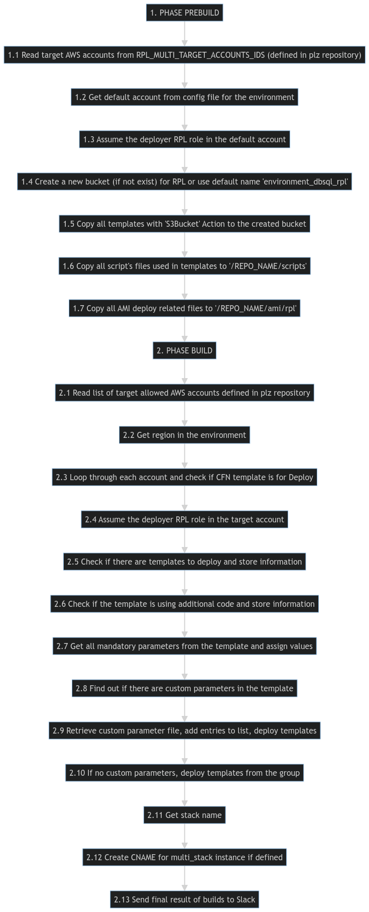
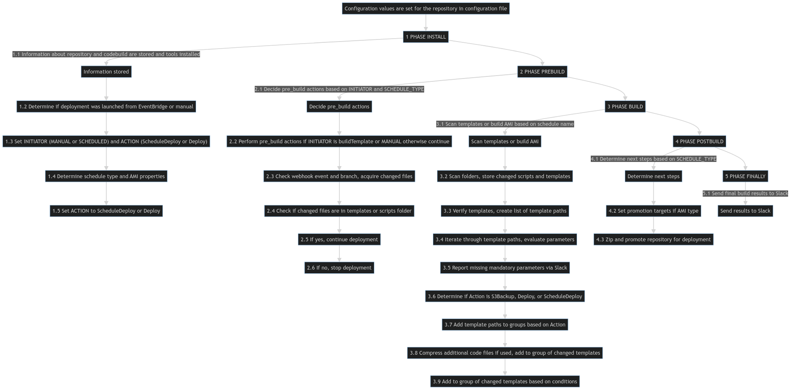

# RPLRepoDraft

The generic template repository 

## Problem description
This is the generic template repository that can be used by forking as the starting point for other repositories. Its goal is to speed up, simplify, and automate the deployment of AWS resources defined in AWS CloudFormation templates created for a given project. The developer can focus on the resources that should be built, not how to build them via RPL in SAP Concur.

This repository provides a set of scripts and configuration files that are used to automate the deployment process, reducing the amount of manual work required for deploying new resources or updating existing ones. All steps of deployment are automated with using a RPL container. There is also a check for any changes, meaning deployment is only run when there are changes on existing objects or if there are any new ones.

The results of every deployment are also presented in the Slack channel [notify-dba](https://concur-blue.slack.com/archives/C04QYFMGW4V).

## RPLRepoDraft usage
This template was already used for deploying all environment resources (AWSEnvDeployHub) for building new windows and linux instances (AWSInstanceDeployHub).
Another usage of this repository is in plan.

## RPLRepoDraft workflow

### initial setting:
1. Configuration values are set for the repository in configuration file

### buildspec:

1. **PHASE INSTALL** 
 - 1.1 Information about repository and codebuild are stored.
 - 1.2 Get info if deployment was launched from EventBridge or manual (merge request) and according this set the project variables SCHEDULE_TYPE, INITIATOR and ACTION.
 - 1.3 INITIATOR can be MANUAL or SCHEDULED which coming from EventBridge.
 - 1.4 According Schedule names is determined the schedule type (buildAMI, buildTemplate, promoeteAMI.. ) and what ami properties will be used in case of AMI baking
 - 1.5 The ACTION can be ScheduleDeploy or Deploy
2. **PHASE PREBUILD**
 - 2.1 According INITIATOR and SCHEDULE_TYPE decide if pre_build actions are need
 - 2.2 If INITIATOR is 'buildTemplate' or 'MANUAL' than do prebuild actions. 
 - 2.3 The prebuild actions is check if webhook event is “PULL_REQUEST_MERGED” and did not come from main branch so the branch name is determined, the branch information is retrieved, the branch is checked out, 
 - 2.4 The group of changed files is acquired and stored in the group of changed files for the next steps.
 - 2.5 If any of the changed files are located in the templates folder or scripts folder there is no need to continue in the deployment process.
 - 2.6 If changed files are detected in the templates folder or in scripts folder so deployment will continue
3. **PHASE BUILD**
 - 3.1 The templates are scanned or ami is build according scheduled name
 - 3.2 The folder scripts and folder with templates is scanned, and a list of changed scripts and templates is stored + list of subfolders where additional code (python, PowerShell) is located is obtained if exist.
 - 3.3 Verification is performed on templates to ensure that the template names comply with Stack names, that there is only one additional code file per subfolder, and that the additional code file is not in the main folder. 
 - 3.4 A list of template paths is created and iterated through. 
 - 3.5 The template is obtained from the list, and its parameters are evaluated. 
 - 3.6 If mandatory parameters are missing, an issue is reported via slack. 
 - 3.7 It is determined whether the mandatory parameter “Action” has a value of “S3Backup”,“Deploy”,"ScheduleDeploy".
 - 3.8 If CFN template contain “S3Backup” Action than the template path is added to the group of templates that will not be deployed directly but instead will be moved to an S3 Bucket and used by DCP ro deployed as nested templates from its master template. 
 - 3.9 If ACTION is “Deploy,” the template path is added to the group of templates with direct deployment.
 - 3.10 It is determined whether the template is in the group of changed templates, if it use additional packages, or if the additional code or parameter-value config file has changed or if it is ScheudleDeploy
 - 3.11 If template use the additional code files so it is compressed, and the template is added to the group of changed templates for deployment
 - 3.12 If template does not use the additional code so is determined whether the template is in the group of changed templates or if the parameter-value config value has changed or if it is ScheudleDeploy so it is added to the group of changed templates.
4. **PHASE POSTBUILD**
 - 4.1 Determine next steps according the schedule type (SCHEDULE_TYPE)
 - 4.2 If SCHEDULE_TYPE is ami type so there is set promotions target from config file
 - 4.3 In other case the whole repository is zipped and promoted with using supply-chain CLI to target environments to initiate the deployment
5. **PHASE FINALLY**
 - 5.1 The final result of the builds is sent to Slack

### buildspec flow chart:
  

### deployspec

1. **PHASE PREBUILD**
  - 1.1 Read the target AWS accounts from RPL_MULTI_TARGET_ACCOUNTS_IDS set by RPL.
  - 1.2 Get the default account from the list of accounts in RPL_MULTI_TARGET_ACCOUNTS_IDS to deploy the environment.
  - 1.3 Assume the deployer RPL role in the default account for the environment.
  - 1.4 Create a new bucket for RPL with the name provided in the configuration file, or use the default name <environment>_dbsql_rpl.
  - 1.5 Copy all templates with the parameter 'Action' and value 'S3Bucket' to the created S3 bucket under the folder '/<REPO_NAME>/CFN'.
  - 1.6 Copy all scripts files used in templates to '/<REPO_NAME>/scripts' in the created bucket.
  - 1.7 Copy all ami deploy related files to '/<REPO_NAME>/ami/rpl' in the created bucket.

2. **PHASE BUILD**
  - 2.1 Read the list of target AWS accounts from RPL_MULTI_TARGET_ACCOUNTS_IDS set by RPL for a given environment.
  - 2.2 Get region in the environment.
  - 2.3 Loop through each account and check if template is for deploy
  - 2.4 Assume the deployer RPL role in the target account.
  - 2.5 Check if there are templates to deploy in the account and store this information to a group of templates for deployment in the account.
  - 2.6 Check if the template is using additional code and store this information.
  - 2.7 Get all mandatory parameters from the template and assign values to them in the format "parameter=value", storing the result in a list of all mandatory parameters and their values.
  - 2.8 Find out whether there are any custom parameters in the template.
  - 2.9 If there are custom parameters, retrieve a file where custom parameters and their values are stored. Find out if there are more entries in the file with custom parameters and add them to the list of custom parameters and their values. Get the  entry keys containing parameter-value combinations in the configuration file. For each entry key, loop through every entry and deploy the template from the group for deployment in the account using mandatory parameters and their values along with different custom values assigned to parameters in the config file for the corresponding key.
  - 2.10 If there are no custom parameters, start deploying the templates from the group of templates for deployment in the account using mandatory parameters and values.
  - 2.11 Get together stack name
  - a. Stack with custom parameters which is not scheduled for deploy has unique name given by key from parameter-value config file
  - b. Stack with custom parameters which is scheduled for deploy monthly (workstation) has unique name every month and more stacks are different by "key" values for same month
  - c. Stack without custom parameters which is scheduled for deploy randomly has unique name consiting from "key" and timestamp value
  - d. Stack is not multi stack (is build only onece in account) and it does not have any custom parameter so stack name is same as template name
  - e. Stack is multi stack (can be build many times in account) and it has custom parameters so stack name is key from parameter-value config file
  - f. Stack file name has entry in main config file where is mapping of template name to existing file name in templates
  - 2.12 Create CNAME for multi_stack instance deployment if CNAME is defined in parameter-value file
  - 2.13 Send the final result of the builds to Slack.

### deployspec flow chart

