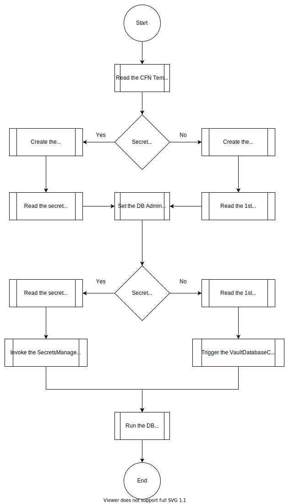
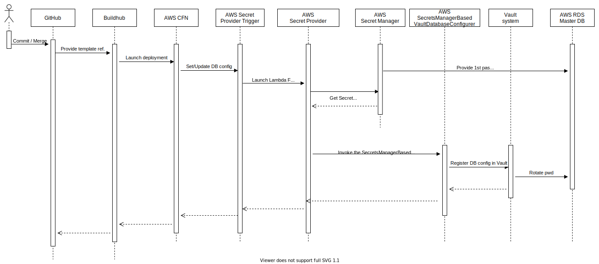

## Secret Manager usage

In this context, we will no longer use a password generated from a lambda function (RandomStringFunction).

For AWS security reasons, we have to read the secret password from a new Lambda function (SecretProvider):
[Dynamic references for secure values, such as secretsmanager, aren't currently supported in custom resources.](https://docs.aws.amazon.com/AWSCloudFormation/latest/UserGuide/dynamic-references.html#dynamic-references-secretsmanager)
Then, this new Lambda function invokes another Lambda function (SecretsManagerBasedVaultDatabaseConfigurer) in order to make the password rotation via the Vault system.
For security reasons, we restrict the call of the SecretsManagerBasedVaultDatabaseConfigurer function to the SecretProvider lambda through the AWS::Lambda::Permission feature.
Only SecretProvider Lambda function can invoke the SecretsManagerBasedVaultDatabaseConfigurer Lambda function.
Likewise, the secret password is no longer stored on an s3 bucket for which a presigned URL existed (for more details see [EDEN-1161](https://jira.concur.com/browse/EDEN-1161) ticket).
This set of Lambda functions is triggered when the Stack is Created or Updated  via a `ChangeRecordID` tag.

As you can see in the following diagram the Secret Provider resource is invoked by the trigger when we create / update the Stack.
But we ignore the delete request via the lambda function : it is caught in the SecretProvider Lambda function and therefore SecretsManagerBasedVaultDatabaseConfigurer is not invoked.

The order is the following :
 1. AWS CFN creates the Secret Manager
 2. and provides the 1st (seed) pwd to the Master DB
 3. We set the Master DB with the seed Password
 4. Launch the Lambda function via the Trigger
 5. Get the secret (the 1st/seed password) from the SecretManager
 6. The Secret Provider function invokes the SecretsManagerBasedVaultDatabaseConfigurer Lambda function with the seed password as an input param.
 7. The SecretsManagerBasedVaultDatabaseConfigurer Lambda function registers the DB config in Vault
 8. Vault rotates the Master DB password

