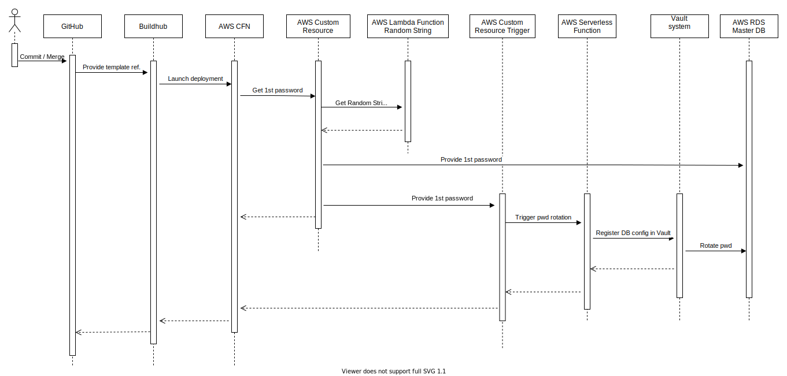

## Setup CFN & Integrate with the Vault database backend
* This project initializes 'rdsmysqldb' database in AWS Mysql environment.

* Made changes in [templates/Solarwinds/SOLWRDS-SOLW.yml] to the database needs.
* The build pipeline does the following tasks
    * First, it will randomly create a password and store it in the environment variable {{ SECURE_PASSWORD }} and uses it as the root password at the time of creation of servers.
    * Then runs a CFN template provided under templates/Solarwinds/SOLWRDS-SOLW.yml, which will create AWS RDS Mysql server to the configuration done in .json file (above). This template accomplishes following tasks
        * Creates Master Database and outputs the connectionStrings & endpoint address & port.
        * Runs a serverless function that assumes vault IAM role to configure the database which also rotates the root password.

Explanation about integration with vault through CFN:



* The below yaml snippet explains about the vault and database configuration integration with CFN through serverless function.
* The function generates a random string, stores it in Vault, and inserts it back into the calling Cloudformation template when invoked from a CFN CustomResource.
* The above task is done through the IAM role (SolwVaultRole) that is linked to role solwRole in Vault (tools/solw) and created in AWS IAM roles with all the required policies attached.
* The vault integration roughly does the following:
    * Generate a random string value to be set as a master database password, and to be passed to the vault database configurer lambda
    * The vault database configurer lambda will register the database in vault and instruct it to rotate the master password. Vault is now the only system with root access to the database
    * Vault then handles the creation and rotation of database users as configured in the namespace's `vault.yml` configuration.
      This only has to be run once, when the database is created.
    * This integration can break. In the event vault loses access to the database, rerunning the vault integration setup will repair this state.
      This is triggered by changing the following resources: `RandomStringResource`, `VaultDatabaseConfigTrigger`, `MasterDB`
      To this end, these resources are tagged by a `ChangeRecordID` tag which changes on every commit, and ensures the password is rotated by cfn and the vault integration is refreshed on every code change.
* Also, after your stack updates, you could need to investigate on an issue and maybe the Lambda function logs could be an interesting sight if you search the database root password rotation (_AWS CloudWatch > CloudWatch Logs > Log groups > /aws/lambda/\*...-VaultDatabaseConfigurer-\*_)
  You could see something as the following messages :
``` START RequestId: 53cebcee-a14a-4634-82ed-4a5e07089e9e Version: $LATEST
Started Function!
2021/02/08 17:45:09 Fetching CA bundle from https://ca.service.cnqr.tech/v1/trust/bundle.crt
2021/02/08 17:45:10 writing CA pem to local fs ...
2021/02/08 17:45:10 CA successfully written to /tmp/vault-ca.pem
2021/02/08 17:45:10 Initialising Vault client
2021/02/08 17:45:10 Fips mode is enabled: true
2021/02/08 17:45:10 Success! Connected to Vault
2021/02/08 17:45:10 Configuring {{username}}:{{password}}@tcp(eden-taskteam-sampleapp-v2-mysql-master.cjmky5jo33vp.us-west-2.rds.amazonaws.com:3306)/ at database/rdscatalogpoc/config/rdscatalogpoc
2021/02/08 17:45:10 Success! Configured to the database at .../rdscatalogpoc and verfied the connection
2021/02/08 17:45:10 Success! Database root password was rotated by Vault
2021/02/08 17:45:10 Optional Configs to load 0
END RequestId: 53cebcee-a14a-4634-82ed-4a5e07089e9e
REPORT RequestId: 53cebcee-a14a-4634-82ed-4a5e07089e9e Duration: 1521.95 ms Billed Duration: 1522 ms Memory Size: 128 MB Max Memory Used: 50 MB Init Duration: 140.95 ms_
```

Policies Required for the IAM role to run the lambda function:
```

  SolwVaultRole:
    Type: "AWS::IAM::Role"
    Properties:
      AssumeRolePolicyDocument:
        Version: 2012-10-17
        Statement:
          - Effect: Allow
            Action:
              - "sts:AssumeRole"
            Principal:
              Service:
                - ec2.amazonaws.com
                - lambda.amazonaws.com
      Description: Vault IAM Role that can assume the role to run a lambda function
      ManagedPolicyArns:
        - !Sub "arn:${AWS::Partition}:iam::aws:policy/AmazonS3ReadOnlyAccess"
        - !Sub "arn:${AWS::Partition}:iam::aws:policy/CloudWatchLogsReadOnlyAccess"
        - !Sub "arn:${AWS::Partition}:iam::aws:policy/IAMReadOnlyAccess"
        - !Sub "arn:${AWS::Partition}:iam::aws:policy/service-role/AWSLambdaBasicExecutionRole"
        - !Sub "arn:${AWS::Partition}:iam::aws:policy/service-role/AWSLambdaRole"
        - !Sub "arn:${AWS::Partition}:iam::aws:policy/service-role/AWSLambdaVPCAccessExecutionRole"
      Path: /
      RoleName: {{ IAMRole defined in vault }}
```

changes in rds-mysql.yaml template file:
```
VaultDatabaseConfigurer:
  Type: AWS::Serverless::Function
  Properties:
    Environment:
      Variables:
        VAULT_ADDR: 'https://vault.service.cnqr.tech:443'
        VAULT_SKIP_VERIFY: '0'
    Handler: bootstrap
    Runtime: provided.al2
    CodeUri: 's3://eden-us-pscc-cfn-vault-utils/utilities/configurer-al2-2.4.0.zip'
    Description: Function to configure the database in vault
    MemorySize: 128
    Timeout: 30   # Allow a high timeout for vault calls to avoid timeout or DNS issues
    Role:
      Fn::Sub:
        - arn:aws-us-gov:iam::${AWS::AccountId}:role/${Role}
        - { Role: !Ref VaultIAMRole }
    VpcConfig:
      SecurityGroupIds:
        - !ImportValue DefaultSecurityGroupId
      SubnetIds:
        - !ImportValue ConcurIntSubnet1Id
        - !ImportValue ConcurIntSubnet2Id
        - !ImportValue ConcurIntSubnet3Id

VaultDatabaseConfigTrigger:
  Type: AWS::CloudFormation::CustomResource
  Version: "1.0"
  Properties:
    ServiceToken: !GetAtt VaultDatabaseConfigurer.Arn
    Role: !Ref VaultRole
    Namespace: !Ref VaultNamespace
    DatabasePlugin: mysql-rds-database-plugin
    DatabasePath: !Ref VaultDatabasePath
    AllowedRoles: !Ref VaultAllowedRoles
    Username: !Ref DBUser
    Password: !Ref DBPassword
    Url: !GetAtt [MasterDB, Endpoint.Address]
    Port: !GetAtt [MasterDB, Endpoint.Port]
    Tags:
      - Key: ChangeRecordID
        Value: !Ref ChangeRecordID
```

Once the creation is successful you'll be able to get to see the Mysql server getting created (updated), and thus creation of dynamic creds are available in vault at:
```
  https://vault.service.cnqr.tech/v1/{namespace}/database/{path}/creds/{role} \
  -H 'X-Vault-Token: {token}' ```
```
## Secret Manager usage

Please follow [this link](./SecretManager.md) for more details
