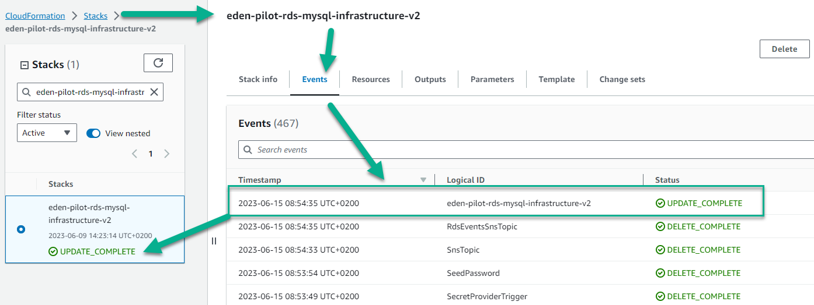
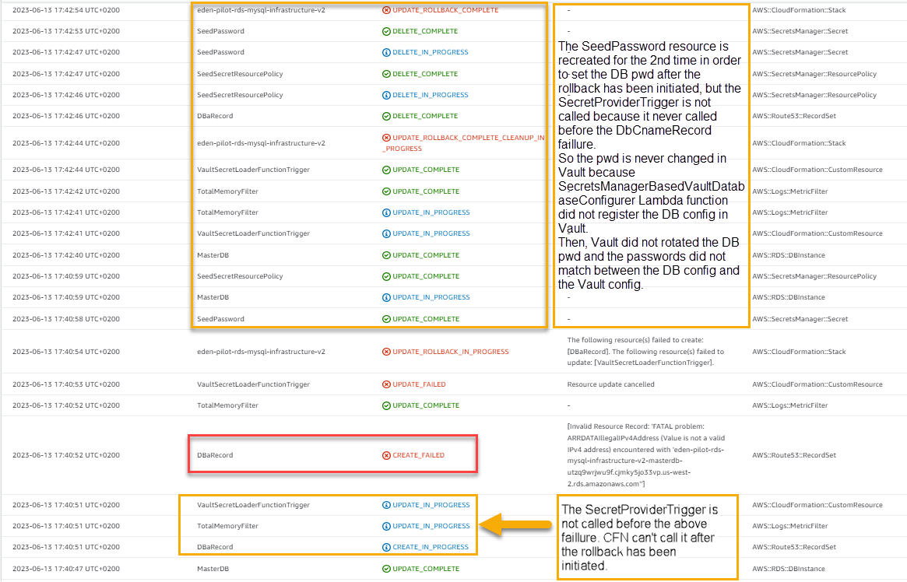

## Troubleshooting *Rollback* status

### Context
In specific cases, an AWS stack update can be completed with a _**....Rollback....**_ status.
When the stack is in this status, the password in the RDS instance and the one in the according Vault database backend configuration are probably out of sync.
To summarize, the issue can occur when the DB password changed but is not set again in Vault configuration when the stack is completed with a _...RollBack...._ status.
The root cause is tied to a trigger which should make the password modification in Vault and was never called before a resource creation/update failure.
The consequence is Vault will no longer interact with the RDS instance blocking especially the creation of dynamic users/credentials.

**Notes**:
* it's possible to have a similar issue with or without secret manager feature activated.
* For more details you can read [this wiki page](https://wiki.one.int.sap/wiki/x/f1yc1w).

### Prerequisites

You need an access right to the AWS console in order to read the Cloud Formation events and the Lambda functions logs of your stack.

### Guidelines

The purpose of this guide is to help you get an **_UPDATE_COMPLETE_** status for your AWS stack.
You should **never** leave a ....Rollback.... status even if you can read _UPDATE_ROLLBACK_COMPLETE_ at the end of the run.

Every time you run the template on Cloud Formation (CFN), the DB is set with a new temporary password (the seed password) and then Vault configuration is set with the same password few seconds later.
As you read before, you have to troubleshoot the root cause of the issue and fix it immediately.
Usually, the password is out of sync because CFN set the RDS password but couldn't invoke the Lambda function which modifies the DB password in Vault due to an issue on another resource.

First of all you have to check the events of your stack update in CFN console:

Your stack should be updated with a similar message (**_UPDATE_COMPLETE_**) in the status column:

If you read a _**....Rollback....**_ status in the events tab **you must**:
- made a revert action to the latest successful stack status by triggering a deployment with the code from the latest successful deployment;
- if it's not possible or not working, provide a fix-forward (via the AWS console, a template modification, a new application permission configuration, ...)

### Examples

The following example shows a stack update and if you make a deep investigation you can notice the Vault configuration is no longer in sync with the current DB password even we can read _UPDATE_ROLLBACK_COMPLETE_ at the end of the run.
Here, the root cause is explained in the status column when you read the events Tab in the CFN console:

In the above image, to resolve the password sync issue, first you have to fix the resource issue and provide a valid IPv4 address in the CFN template.
Commit you change in the Github repository and make a new PR, then make a new deployment.
Finally, CFN should create the new resource (here the DBaRecord Logical ID) without any error and the password should be sync between the DB and the Vault configuration.

